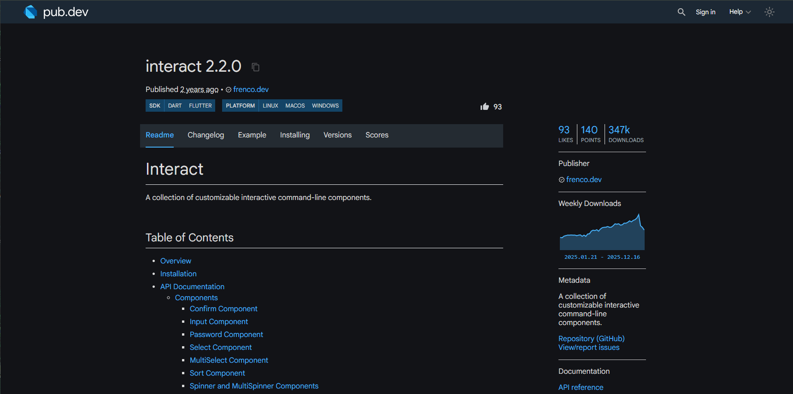

Мы уже выяснили что большую роль в программировании занимают способы *представления* или *выражения* иформации.

Мы можем выразить информацию о имени, возрасте и поле человека таким образом:
```dart

// Создадим ти для пола
enum Gender { man, woman, helicopter }

String name = 'Igor'; // имя
int age = 24; // возраст
Gender gender = Gender.man; // пол (мужчина)
``` 

Но теперь представь нам нужно работать не с одним человеком, а с парой, или десятком людей одновременно, что ты сделаешь тогда?

```dart
String name1 = 'Igor';
String name2 = 'Vova';
...
String name10 = 'Zebra';
// и теперь тоже самое для остальных полей: возраста, их полов...
int age1 = 24; 
int age2 = 2; 
...
// в общем так не пойдет
``` 

Может мы вместо этого как то представим самого человека? Чтобы у нас был тип Человек (`Human`). И чтобы он как-то хранил все эти данные о самом человеке и мы могли получить к ним доступ?

```dart
Human person;
int vozrast = person.age // получаем доступ к значению возраста
person.name
person.gender
``` 

Если бы мы использовали для этого `enum` мы бы могли сделать что то типо такого:

```dart
enum Human { small, big, old, young, woman, man, igor }
```
:::caution
Но в таком случае создавая человека мы будем иметь доступ только к одному значению, и наш человек может быть либо маленьким, либо старым, либо Игорем, но не несколькими значениями вместе.
:::

Нам нужен не просто перечисленный список ограниченых значений (enum), а скорее что-то что вместит те значения которые прежде мы поместили в переменные `age`, `name`, `gender`. Нам нужен *контейнер для наших контейнеров*.

Подобным нам могут послужить **классы** (`class`).

## Классы
Давайте создадим класс человека таким образом и положим в него все данные которые нам нужны:

```dart
class Human {
    String name = 'Igor'; // имя
    int age = 24; // возраст
    Gender gender = Gender.man; // пол (мужчина)
}
```
Используем класс:
```dart
void main() {
    Human person = Human(); // Создаем таким образом нашего человека
    print(person.name); // Выведет в терминал: Igor
    person.name = 'Dimas'; // Поменяли имя
}
```

:::tip
Мы можем менять все переменные находящиеся в классе (его атрибуты) если они не `final`.
:::

---

Но было бы удобнее чтобы мы не создавали одинакового человека с одинаковыми характеристиками, *а могли создавать разных людей*.

Для этого у классов есть **конструкторы**

```dart
class Human {
    // Конструктор класса
    Human(this.name, this.age, this.gender);

    String name; // имя
    int age; // возраст
    Gender gender; // пол (мужчина)
}

void main() {
    // Создаем таким образом нашего человека
    Human person = Human('Igor', 24, Gender.man); 

    print(person.name); // Выведет в терминал: Igor
    print(person.age); // Выведет в терминал: 24
    print(person.gender); // Выведет в терминал: Gender.man
}
```
* Конструктор создается используя тоже имя что и у класса.
* В скобки идут аргументы которые принимает этот конструктор.
* когда мы исполбзуем this.названиеПоля - это говорит чтобы конструктор сразу положил то что мы ему даем в поле с тем же именем.


И чем еще хороши классы это тем что мы можем упаковывать в них еще и *действия*.
Перед тем как продолжить посмотрим на полное определенние (простым языком):

:::note
#### Что такое класс?

Класс это «чертёж» или шаблон для создания «объектов».

Класс определяет свойства (что объект имеет: цвет, имя) и методы (что объект может делать: ехать, поздороваться), а затем на его основе можно создавать множество одинаковых по структуре, но разных по содержанию объектов, как копий с чертежа.


#### А что такое объект?
Объект — это конкретное воплощение класса, реально существующее в памяти компьютера. 
Если класс — это чертеж или рецепт, то объект — это готовое здание или испеченный по рецепту пирог.

Об объектах нам нужно знать только две вещи: у них есть свои свойства и поведение.
:::

Мы уже задали поля свойств для класса `Human`, давайте зададим поведение - какие поведеения бывают у людей, что они могут делать?

Ну например они могут здароваться с кем-то. Давайте пропишем это:

```diff lang="dart" {22-22}
class Human {
    // Конструктор класса
    Human(this.name, this.age, this.gender);

    String name; // имя
    int age; // возраст
    Gender gender; // пол (мужчина)


+    // Прописываем поведение. Функция "поздороваться".
+    // Принимает как аргумент другого человека (other) чтобы обратится к нему по имени:
+    void greet(Human other) {
+        print('Привет ${other.name}! Меня зовут $name');
+    }
}

void main() {
    // Создаем таким образом нашего человека
    Human igor = Human('Igor', 24, Gender.man); 
    Human ivan = Human('Ivan', 99, Gender.helicopter); 

    igor.greet(ivan); // Выведет в консоль "Привет Ivan! Меня зовут Igor"
}
```
---
#### Моделирование
В сущности когда мы создали класс человека, мы *смоделировали* реального человека. Ведь что такое модель? Это отражение только тех характеристик реального объекта, **которые важны для вашей задачи**.

Например глобус это модель земли

> Он не имеет всех тех характеристик что и объект который он изображает - величины, наличия атмосферы и жизни на основе углерода. Но имеет те характеристики что важны: очертание суши и моря, границы стран, шарообразная форма.

Таким образом ты можешь смоделировать в коде все что угодно. Посмотри на объекты вокруг - какие свойства и поведение они имеют?

В теории если ты смоделируешь объект достаточно подробно, он перестанет отличаться от оригинала!


## Еще пример
Вот чертеж машины, в данном случае *Mercedes-Benz 300 SL Coupé*:


В реальной жизни этот чертеж может использоваться для создания на фабрике какого угодно количества объектов (экземпляров, *на англ.: instance*) автомобилей этого типа (например 1,000,000 мерседесов).

Давайте подумаем как бы выглядел класс этого автомобиля (аналог реального чертежа только в программировании):
```dart
// Называем класс
class MercedesBenz300SLCoupe {
    // Конструктор объектов этого типа:
    MercedesBenz300SLCoupe({
        required this.vin,
        required this.year,
        required this.color,
    });

    // 1. СВОЙСТВА

    // Поля которые одинаковы и неизменны для всех создаваемых машин этого типа:
    // Они заданны сразу, поэтому в конструкторе они не нужны
    static const String brand = 'Mercedes-Benz';
    static const String model = '300 SL Coupé';

    static const int engineDisplacementCc = 2996; // Объем вымещения двигателя
    static const int powerHp = 215;  // Лошадиные силы

    // После того как машина создается, эти характеристики остаются неизменны (final):
    final String vin; // Идентификационный номер
    final int year; // Год создания

    // Эти поля могут меняться в ходе жизни объекта:
    // Но они приватны для этого класса (благодаря _) -
    // это значит менять их могут только методы класса (не могут менятся извне)
    String _color; // Цвет
    int _mileageKm = 0; // Пробег, машина создается с 0 км пробега
    
    // 2. ПОВЕДЕНИЕ

    // Перекрасить машину
    void repaint(String newColor) => color = newColor;

    // Поездить на машине (добавляет пробег)
    void drive(int km) {
        if (km < 0) throw ArgumentError('Пробег нельзя уменьшать.');
        mileageKm += km;
    }
}
```
Реальный чертеж много внимания уделяет размерам автомобиля - это тоже можно было бы указать - добавить все эти поля как статичные неизменяемые свойства (`width`, `height`, `length`). Но мы для примера не будем.
```dart
void main() {
  final car = MercedesBenz300SLCoupe(
    vin: 'W198-DEMO-0001',
    year: 1955,
    color: 'Silver'
  );

  print(car);

  // Меняем состояние
  car.repaint('Red');
  car.drive(120);

  print(car);

  // это менять нельзя, потому что final:
  // car.vin = 'OTHER';  // ❌ ошибка компиляции
  // car.year = 1956;    // ❌ ошибка компиляции
}
```


## Мини-задача
Написать класс для прямоугольника и прямоугольного треугольника, которые могут рисовать себя в терминале используя '#':
```text
####
#  #
#  #
####

#
##
###
####
```
- Прямоугольник создается из высоты и ширины
- Треугольник создается из двух сторон прилегающих к прямому углу

Они оба должны внутренне знать свои площадь и периметр, треугольник должен знать свою гипотенузу

## Задача
Создай cli-приложение приложение «Список дел» (таск-менеджер)

<video controls width="720">
  <source src="../../../../../../public/assets/todo_app_recording.mp4" type="video/mp4" />
</video>

Ключевые функции:
1. Создание задачи (task - задача)
2. Возможность отметить задачу выполненой
3. Отредактировать текст задачи
4. Удалить задачу
5. Хранение всех задач локально, с сохранением при перезапуске.

:::note
Создание, Чтение, Редактирование и Удаление - это классические операции многих приложений.

От заметок и таск-менеджеров до Социальных сетей, Интернет-магазинов и Банковских приложений - все используют эти операции! Они настолько распространены что для них есть своя абривиатура:

**CRUD** - Create, Read, Update, Delete
:::

---

Обычно мы начинали кодить проект с того что создавали файл, это подходит для маленьких скриптов, которые не используют внешних библиотек.

В этот раз пойдем более професиональным путем, создадим целый проект. Введи в терминале (поставь свое название для проекта вместо your_project_name):
```bash
dart create your_project_name
```

Папка `bin/` содержит главный запускаемый файл, внутри него входная `main()` функция.
В папке `lib/` находится весь рабочий код, все функции нужные для работы приложения.

Ты можешь запустить проект через терминал

```bash
dart run
```

С чего начать? Вот несколько путей:
1. Подумай над тем как будет происходить взаимодействие юзера с приложением. Задай себе вопрос:
    - что юзер должен увидеть когда запустит мое приложение?
    - как он должен взаимодействовать с программой?
:::tip
Это приложение возможно сделать теми 'инструментами' которые мы уже использовали: функция для вывода текста `print()`, функция для чтения ввода `stdin.readLineSync()`.

Но я в демо использовал внешнию библиотеку [`interact: ^2.2.0`](https://pub.dev/packages/interact)



Pub.dev это сайт где ты можешь найти код написанный другими разработчиками на языке Dart, чтобы использовать у себя в программе. Так же ты сам можешь написать такой код, он называется `package` (пакет) и выложить его.

На сайте пакета есть вся инструкция о том что этот пакет делает, как его установить (вкладка `install`), и как с ним работать.
:::

2. Также подумай над тем какие сущности будут в твоем проекте. Сущность, так же entity, это объекты в твоей программе, их нужно смоделировать, то есть написать для них классы, в которых ты укажешь какие свойства у них есть, и что они делают.
    - Рекомендую смоделировать to-do объект - задачи пользователя, и сделать одну сущность которая будет ими управлять - создавать, редактировать и все что было упомянуто выше..

3. Подумай как ты будешь хранить данные пользователя. Предлагаю простейший способ - хранение в json файле.

:::note
JSON-файл — это обычный текстовый файл для хранения данных в виде пар \{ключ: значение} - (словарей) и **списков** - [значение, значение, значение].

Пример, как выглядит внутри (`tasks.json`):

```json
{
  "tasks": [
    { "id": 1, "text": "Купить молоко", "done": false },
    { "id": 2, "text": "Сделать дз", "done": true }
  ]
}
```
* `{}` — один объект с полями
* `[]` — список объектов
:::